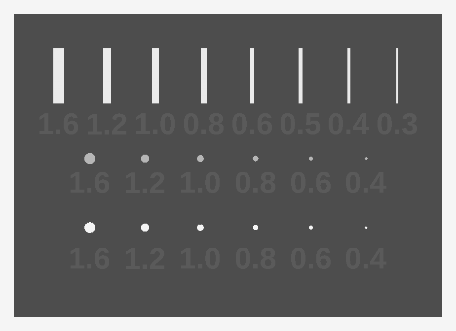

# Test rozdzielczości małych detali

Odpowiada na jedno pytanie: **jak cienki detal wychodzi jeszcze używalny
na A1 z dyszą 0.4?** Potrzebne, zanim zaczniemy cokolwiek projektować
w skali modelarskiej (1:64 / 1:43 / 1:24) — tam większość elementów
ląduje poniżej 1 mm, czyli w okolicach szerokości pojedynczej ścieżki.

Model: [`cad/test-mini.py`](cad/test-mini.py) → [`cad/test-mini.FCStd`](cad/test-mini.FCStd)



## Co to jest

Płytka **62 × 44 × 1.6 mm** z trzema rzędami. Każdy detal ma **wypukły opis
z własnym wymiarem** — po wydruku odczytasz z samej płytki, co jest co,
bez zaglądania tutaj.

| rząd | co | wymiary | odpowiada elementowi |
|---|---|---|---|
| **górny** — 8 żeber pionowych | ścianka stojąca, wys. 6 mm | 1.6 / 1.2 / 1.0 / 0.8 / 0.6 / 0.5 / 0.4 / 0.3 | statywy skrzydła, żebra dyfuzora, canardy |
| **środkowy** — 6 kołków | walec, wys. 4 mm | Ø 1.6 / 1.2 / 1.0 / 0.8 / 0.6 / 0.4 | kołki pozycjonujące, łączenie części |
| **dolny** — 6 otworów | na wylot przez bazę | Ø 1.6 / 1.2 / 1.0 / 0.8 / 0.6 / 0.4 | gniazda pod te kołki |

Kołki i otwory mają **te same nominalne średnice** — po wydruku sprawdzasz,
który kołek wchodzi w który otwór. To daje realny luz pasowania na Twojej
maszynie, przy tej wielkości detalu. Nie przepisuj tej liczby z pasowań
dla dużych części: przy Ø 0.6 mm stosunek luzu do średnicy jest zupełnie inny.

## Materiał

**PLA** — najlepiej odwzorowuje drobne detale ze wszystkiego, co masz.
Nawet jeśli docelowa część ma być z PETG, ten test rób na PLA: chodzi
o wyznaczenie granicy możliwości maszyny, nie o wytrzymałość.

## Ustawienia druku

> Punkt wyjścia, nie pewnik — po to jest ten wydruk.

| | |
|---|---|
| Warstwa | **0.12 mm** (niżej niż zwykle — liczy się detal, nie czas) |
| Ścianki | 2 |
| Wypełnienie | 15 % (baza i tak jest cienka) |
| Prędkość ścianek zewn. | **obniż do ~40 mm/s** — cienkie żebra mają małą podstawę i wibrują |
| Chłodzenie | 100 % |
| Orientacja | płasko, żebra i kołki do góry |
| Podpory | nie |
| Brim | nie |

Zużycie: ~4.8 cm³, czyli **około 6 g** — test kosztuje tyle co nic.

### Zanim wyślesz na drukarkę — obejrzyj podgląd w slicerze

Slicer potrafi **całkowicie pominąć** detal cieńszy niż szerokość ścieżki.
Jeśli w podglądzie żebra 0.4 i 0.3 nie mają żadnych linii — one się nie
wydrukują i **to też jest wynik testu**. Zanotuj, od której grubości slicer
przestaje cokolwiek generować, *zanim* zobaczysz, co wyszło z drukarki.
Inaczej nie odróżnisz „drukarka nie dała rady" od „slicer tego nie wysłał".

W Bambu Studio sprawdź opcję **„Detect thin walls" / „Wykrywanie cienkich
ścianek"** — włączona zmienia wynik, więc zanotuj, w jakim stanie była.

## Jak ocenić wynik

Dla każdego żebra (od najgrubszego) zapisz:

- **jest / nie ma** — czy w ogóle się wydrukowało
- **stoi / faluje** — czy jest proste, czy pofalowane od nadmiaru ciepła
- **wytrzymuje paznokieć** — czy odłamie się przy lekkim nacisku z boku

Pierwsza grubość idąc od lewej, która przechodzi wszystkie trzy, to
**realne minimum dla pionowej ścianki na tej maszynie** — ta liczba trafia
potem do `CLAUDE.md` obok obecnego 1.2 mm i decyduje, w jakiej skali
w ogóle opłaca się projektować modele.

## Status

**Wygenerowane, nie wydrukowane.**

Weryfikacja geometrii (FreeCAD, headless):

```
Baza     zwiazany=True   DOF=0
Zebra    zwiazany=True   DOF=0
Kolki    zwiazany=True   DOF=0
bryla valid  : True
bryl w czesci: 1
bbox [mm]    : 62.0 x 44.0 x 7.6
objetosc     : 4757.7 mm3  (~5.9 g PLA)
```

Przekrój na wysokości z = 4 mm potwierdził, że żebra mają dokładnie
1.600 / 1.200 / 1.000 / 0.800 / 0.600 / 0.500 / 0.400 / 0.300 mm,
a kołki Ø 1.600 / 1.200 / 1.000 / 0.800 / 0.600 / 0.400 mm.

## Wnioski

*(do uzupełnienia po wydruku)*

| żebro | grubość | wydrukowane? | proste? | wytrzymałe? |
|---|---|---|---|---|
| 1 | 1.6 | | | |
| 2 | 1.2 | | | |
| 3 | 1.0 | | | |
| 4 | 0.8 | | | |
| 5 | 0.6 | | | |
| 6 | 0.5 | | | |
| 7 | 0.4 | | | |
| 8 | 0.3 | | | |

**Realne minimum ścianki pionowej: ______ mm**
**Od której grubości slicer przestał generować ścieżki: ______ mm**

| kołek Ø | ocalał? | w który otwór wchodzi? |
|---|---|---|
| 1.6 | | |
| 1.2 | | |
| 1.0 | | |
| 0.8 | | |
| 0.6 | | |
| 0.4 | | |

## Edycja

Wymiary siedzą w arkuszu `Parametry` w pliku `.FCStd` — otwórz we FreeCAD,
zmień liczbę, odśwież.

**Uwaga:** opisy na płytce **nie są** sterowane arkuszem — powstają z list
`ZEBRA` i `SREDN` na górze skryptu. Zmiana samego arkusza przeliczy geometrię,
ale zostawi stare cyfry. Żeby oba się zgadzały, zmieniaj listy w skrypcie
i generuj od nowa:

```bash
OUT_DIR=. freecadcmd cad/test-mini.py
```

STL eksportuję z jawnie zadaną dokładnością siatki (0.02 mm, ~12 tys.
trójkątów). Domyślna tesselacja rozbija się na krzywych liter i daje plik
sześć razy większy bez żadnego zysku — 0.02 mm to i tak sześć razy mniej
niż warstwa druku.
