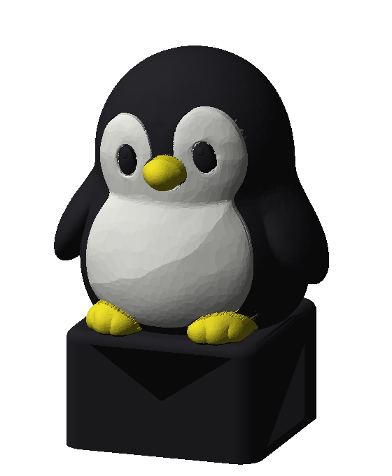
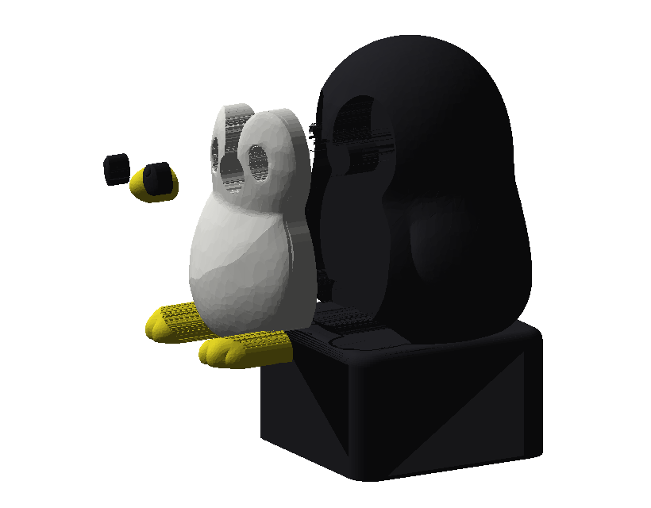
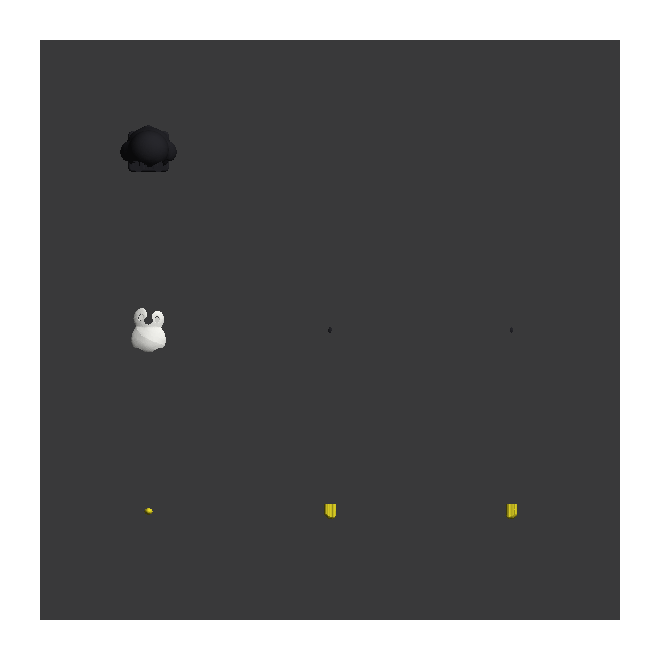

# Pingwin-keycap — podział na części jednokolorowe

Rozbicie gotowego, malowanego wielokolorowo modelu 3MF na **7 osobnych części, każda
w jednym kolorze** — żeby wydrukować go z AMS Lite **bez zmian filamentu w trakcie
druku i bez wieży czyszczącej**, a potem skleić.



## Model źródłowy

**„ペンギンのキーキャップ" (Penguin keycap)**, autor **Melodybox**, MakerWorld,
licencja *Standard Digital File License*.

> **Plików modelu (STL / 3MF) nie ma w tym repo i nie wolno ich tu wrzucać** — ta
> licencja nie pozwala na dalsze udostępnianie plików ani ich pochodnych, a repo
> jest publiczne. W repo jest tylko **mój skrypt** ([`cad/podziel_na_kolory.py`](cad/podziel_na_kolory.py)),
> który odtwarza podział z Twojego pliku 3MF. Pliki do druku trzymaj lokalnie.

Oryginał był przygotowany pod **H2D, dyszę 0.2 mm, warstwę 0.1 mm i filament podporowy** —
czyli nie pod nasz sprzęt. Uwagi z tego wynikające są niżej, w „Wnioskach".

## Cel

Malowanie kolorami w Bambu Studio jest wygodne, ale przy modelu tej wielkości
zmiana koloru wypada **w prawie każdej warstwie**. Na wieżę czyszczącą idzie wtedy
wielokrotnie więcej filamentu niż waży sam model, a druk trwa kilka razy dłużej.
Rozbicie na części jednokolorowe zamienia setki zmian filamentu na **dwie**.

## Na czym polega podział

Kolor w 3MF to **malowanie powierzchni**, nie bryły — nie da się go po prostu
„rozciąć". Dlatego każda plama koloru zamieniana jest na **wtopkę** (plug): bryłę
ograniczoną z przodu oryginalną powierzchnią modelu, a z tyłu płaską płaszczyzną.
Korpus dostaje dokładnie dopasowane gniazdo.



Technicznie: dla każdej plamy liczony jest jej **cień** — rzut na płaszczyznę XZ
wzdłuż osi Y (pingwin patrzy w −Y, wszystkie kolory są z przodu). Cień wyciągnięty
w rurę i przecięty półprzestrzenią daje obszar cięcia, a dalej wystarczają booleany:

```
korpus  = bryła − suma(obszarów cięcia)
wtopka  = (obszar cięcia zmniejszony o luz) ∩ bryła
```

Podział jest **dokładny**: suma objętości części = objętość bryły minus luzy
montażowe (kontrola w skrypcie pokazuje 1,23 % — dokładnie tyle, ile wynoszą luzy).

### Części

Numeracja plików = **kolejność druku** (pogrupowana kolorami, korpus na końcu):

| # | plik | filament | gabaryty [mm] | orientacja na stole | podpory |
|---|---|---|---|---|---|
| 1 | `dziob` | 3 żółty | 3,6 × 2,9 × 3,4 | płaskim tyłem na stół | nie |
| 2 | `stopa-L` | 3 żółty | 5,1 × 6,8 × 2,3 | płaskim spodem na stół | nie |
| 3 | `stopa-P` | 3 żółty | 5,1 × 6,8 × 2,3 | płaskim spodem na stół | nie |
| 4 | `front` | 2 biały | 15,3 × 19,3 × 6,0 | płaskim tyłem na stół | nie |
| 5 | `oko-L` | 1 czarny | 1,8 × 2,5 × 2,0 | płaskim tyłem na stół | nie |
| 6 | `oko-P` | 1 czarny | 1,7 × 2,5 × 2,1 | płaskim tyłem na stół | nie |
| 7 | `korpus` | 1 czarny | 24,9 × 20,8 × 34,3 | bazą keycapa na stół | **tak** |

Każda część ma **płaską ścianę przylegającą do stołu** (dno gniazda albo półka pod
stopą) — dlatego tylko korpus potrzebuje podpór, i to wyłącznie pod skrzydełkami
i pod wybrzuszeniem ciała nad bazą.

`plyta-pingwin-keycap.3mf` ustawia je w **siatce 3 × 3 ze skokiem 80 mm**, rzędami
od lewej do prawej, od przodu stołu do tyłu — czyli fizyczny układ pokrywa się
z kolejnością druku. Korpus siedzi sam w ostatnim rzędzie.



## Materiał

**PLA** (najlepiej PLA Matte na czarny i biały — matowa powierzchnia ukrywa warstwy
na krągłym brzuchu; żółty może być Basic, i tak jest go mało).

Dlaczego PLA, a nie PETG: to element dekoracyjny na klawiaturze, w pomieszczeniu —
nie ma tu ani obciążeń, ani temperatury. PLA daje ostrzejszy detal (dziób i palce
u stóp mają po 2–3 mm), mniej „ciągnie nitki" i **znacznie lepiej klei się na
cyjanoakryl** niż PETG. Trzonek MX pracuje na wciskanie, nie na rozrywanie warstw.

ASA odpada — to nie jedzie do samochodu, a warping na otwartej A1 psułby pasowanie
wtopek.

Zużycie: cały model to ~6,8 cm³, czyli **około 8,5 g** filamentu razem.

## Ustawienia druku

| | |
|---|---|
| Warstwa | 0,08 mm (detal) lub 0,12 mm (szybciej) |
| Dysza | 0,4 mm — **oryginał był robiony pod 0,2 mm, patrz Wnioski** |
| Ścianki | 3 perymetry |
| Wypełnienie | 15 % (części są małe, i tak wyjdą prawie lite) |
| Podpory | tylko `korpus`, drzewiaste (auto) |
| Kolejność druku | **„po obiekcie" (by object)** — patrz niżej |

> Wszystkie liczby powyżej to **punkt startowy, nie pewniki** — na mojej A1 nie były
> jeszcze sprawdzone. Osobno do przetestowania: pasowanie trzonka MX i pasowanie
> wtopek (patrz `kalibracja/`).

## Jak wydrukować to bez zmian filamentu

Sam podział na części **nie wystarczy**: jeśli położysz na płycie obiekty
w różnych kolorach i zostawisz domyślną kolejność „po warstwie", drukarka i tak
będzie zmieniać filament w każdej warstwie. Trzeba jedno z dwóch:

**A. Jedna płyta, 2 zmiany filamentu** *(polecam)* — `Inne` → `Tryb specjalny` →
**Kolejność druku: „po obiekcie"**. Drukarka kończy cały obiekt, zanim przejdzie
do następnego.

**B. Jedna płyta, zero zmian** — zostaw kolejność „po warstwie", ale wyłącz
drukowanie części w innych kolorach (prawy przycisk na obiekcie → *Printable*)
i puść płytę **trzy razy**: raz żółte, raz biały, raz czarne. Zero odpadu,
kosztem trzech startów.

### Kolejność druku „po obiekcie"

Kolejność bierze się **wyłącznie z listy obiektów, nie z położenia na płycie**.
W lewym panelu, w sekcji `Proces`, przełącz `Globalne` → **`Obiekty`**: to jest
lista obiektów i **kolejność druku ustawia się przeciąganiem wierszy** (obiekt
wyżej na liście drukuje się wcześniej). Przeciąganie działa tylko przy
„po obiekcie" — przy „po warstwie" Bambu Studio je blokuje.
**Ctrl+E** włącza i wyłącza podpisy `Sekwencja#` pod obiektami na płycie.

W `plyta-pingwin-keycap.3mf` kolejność jest już ustawiona — obiekty idą w pliku
w kolejności druku, więc nic nie trzeba przeciągać:

```
1 dziob    2 stopa-L   3 stopa-P     <- filament 3 (żółty)
4 front                              <- filament 2 (biały)   ← 1. zmiana
5 oko-L    6 oko-P     7 korpus      <- filament 1 (czarny)  ← 2. zmiana
```

Czyli **dwie zmiany filamentu na cały model**. Kolejność „od lewej do prawej"
sama z siebie tego nie daje — gdyby kolory się w niej przeplatały, zmian byłoby
sześć. Dlatego układ na płycie jest ustawiony tak, żeby kolejność od lewej do
prawej **pokrywała się z grupami kolorów**.

### Dlaczego korpus jest ostatni

To nie estetyka, to liczby z profilu A1:

| | |
|---|---|
| `extruder_clearance_height_to_rod` | **25 mm** — powyżej tej wysokości belka portalu może zahaczyć o gotowy wydruk |
| `extruder_clearance_max_radius` | **73 mm** — tyle miejsca głowica potrzebuje wokół siebie, żeby objechać to, co już stoi |
| wysokość `korpus` | **34,3 mm** |

Korpus przekracza 25 mm, więc Bambu Studio pokazuje **„korpus jest zbyt wysoki,
mogą wystąpić kolizje"**. Drukowany **jako ostatni** przestaje być problemem —
po nim głowica nie musi już nad niczym przejeżdżać. Ostrzeżenie może zostać
(sprawdzanie jest zachowawcze); warto to potwierdzić w `Podglądzie`, przewijając
ruchy jałowe ostatniego obiektu.

Z tych samych 73 mm wynika, że w trybie „po obiekcie" części **muszą** stać
daleko od siebie — dlatego skok siatki to 80 mm, a nie 4 mm jak przy zwykłym
druku warstwowym. Jeśli slicer i tak marudzi na odstępy, kliknij
**Rozmieść automatycznie** — przesuwa części, ale **nie zmienia ich kolejności**.

## Montaż

Kolejność ma znaczenie — `front` musi wejść przed dziobem i oczami:

1. **`front`** (biały) → wsuń poziomo od przodu w wielką wnękę w korpusie.
2. **`stopa-L` / `stopa-P`** (żółte) → wsuwają się od przodu, siadają na półce
   przy górnej krawędzi bazy (ta półka ustawia je na wysokość — nie da się ich
   wcisnąć za nisko).
3. **`dziob`** (żółty) → wchodzi w wycięcie w białym froncie, w gniazdo w korpusie.
4. **`oko-L` / `oko-P`** (czarne) → w płytkie gniazda na twarzy białego frontu.

Klej: **cyjanoakryl w żelu** (żel, nie płynny — płynny wciąga się kapilarnie
w szczelinę i wyjdzie na wierzch). Odrobina na dno gniazda, nie na krawędzie.

Luzy: **0,10 mm na stronę**, plus 0,15 mm szczeliny na klej na dnie gniazda.
Krawędzie licowe (te widoczne) są bez luzu — szew ma być zamknięty.
Jeśli wtopki okażą się za ciasne, wygeneruj części ponownie z `LUZ = 0.15`.

## Status

`szkic` — geometria policzona i sprawdzona (wszystkie 7 części szczelne,
jednobryłowe, spójne orientacyjnie), **nic jeszcze nie wydrukowane**.

## Wnioski

1. **Malowania powierzchni nie da się „pociąć" płaszczyznami.** Plamy koloru na
   pingwinie są rozrzucone po froncie i żadna płaszczyzna nie rozdziela ich bez
   zabrania po drodze kawałka innego koloru. Jedyne, co działa, to zamiana plamy
   na bryłę: powierzchnia modelu z przodu, płaska ściana z tyłu. Przy okazji ta
   płaska ściana rozwiązuje drugi problem — daje każdej części naturalną
   płaszczyznę do położenia na stole.

2. **Kierunek rzutowania jest jednym parametrem dla całości i musi być wspólny.**
   Kusiło mnie, żeby każdą plamę rzutować wzdłuż jej własnej normalnej (dla stóp
   wyszłoby ładniej). Ale wtedy obszary cięcia sąsiednich plam zachodzą na siebie
   albo zostawiają między sobą papierowe wióry, których nie da się wydrukować.
   Wspólne −Y jest lokalnie gorsze, za to daje **dokładny podział**.

3. **Cień trzeba liczyć jako sumę rzutów trójkątów, nie z konturu brzegu plamy.**
   Stopy i dziób „zawijają się" — część ich powierzchni patrzy w bok albo do tyłu
   (42 % pola stopy ma normalną odchyloną od −Y o więcej niż 84°). Kontur brzegu
   rzutowany na płaszczyznę sam się wtedy przecina i wychodzi z tego śmieć.
   Suma rzutów trójkątów (Clipper2, reguła NonZero) obejmuje całą sylwetkę i jest
   odporna na zawinięcia.

4. **Oczu nie da się zrobić jako czopków na korpusie.** Pierwszy pomysł: zostawić
   oczy przyklejone do czarnego korpusu i zrobić dziury w białym froncie. Gniazdo
   frontu ma 6 mm głębokości, więc czopek oka wyszedłby 1,9 × 1,0 × 3,8 mm —
   i sterczałby **poziomo w powietrzu** w środku wnęki. Nie do wydrukowania bez
   podpór, a podpory w takim miejscu to porażka. Oczy muszą być osobnymi,
   drobnymi wtopkami w białym froncie.

5. **Model z „Image to 3D" ma śmieci w siatce, których slicer nie pokazuje.**
   1,49 mln trójkątów (0,02 mm na trójkąt!), 323 krawędzie brzegowe i 320 krawędzi
   użytych 3 razy — mikroskopijne płatki wielkości 0,02 mm. Booleany nie ruszą
   takiej siatki, trzeba ją najpierw naprawić. Plus 463 plamki malowania poniżej
   1 mm² (łącznie 0,84 mm²) — szum po malowaniu, do scalenia z otoczeniem.

6. **`float32` w STL potrafi rozszczelnić gotową siatkę.** Części wychodziły
   szczelne, a po zapisaniu do STL już nie. Przyczyna: przesunięcie na współrzędne
   płyty (x ≈ 128 mm) — tam krok `float32` jest **osiem razy grubszy** niż przy
   zerze i skleja sąsiednie wierzchołki w krawędź niemanifoldową. Dlatego siatki
   zostają przy początku układu, a pozycję na płycie niesie `transform` w 3MF,
   i domykanie siatki jest **ostatnim** krokiem, po wszystkich przesunięciach.

7. **Dysza 0.4 zamiast 0.2 — czego się spodziewać.** Oryginał był projektowany pod
   0,2 mm i filament podporowy. U nas: rowki między palcami u stóp (~0,5 mm)
   w dużej mierze się zleją, dziób i oczy stracą ostrość krawędzi, a **trzonek MX
   jest największym znakiem zapytania** — jego krzyż ma ścianki ~1,2 mm i luzy
   ~1,3 mm, czyli dokładnie na granicy tego, co 0,4 potrafi trafić wymiarowo.
   **Wydrukuj najpierw sam `korpus` i przymierz go do przełącznika**, zanim
   pójdzie reszta.

8. **Tryb „po obiekcie" dyktuje układ płyty, nie odwrotnie.** Najpierw upakowałem
   części ciasno (81 × 21 mm, odstęp 4 mm) — i to jest bezużyteczne, bo w tym trybie
   głowica objeżdża to, co już stoi, i potrzebuje wokół siebie 73 mm. Bambu Studio
   samo to naprawia („Rozmieść automatycznie"), ale wtedy rozrzuca części
   i traci się kontrolę nad tym, co gdzie leży. Lepiej od razu generować siatkę
   ze skokiem 80 mm, w kolejności druku.

9. **Kolejność druku siedzi w kolejności obiektów w pliku 3MF.** Slicer nie czyta
   jej z położenia na płycie — bierze ją z listy obiektów, a lista to po prostu
   kolejność `<object>` w `3dmodel.model`. Więc kolejność da się zapiec w pliku
   i nie trzeba nic przeciągać ręcznie. Przy okazji: „od lewej do prawej" i „mało
   zmian filamentu" to dwa różne wymagania — muszą się pokrywać celowo, przez
   ustawienie części na płycie grupami kolorów.

10. **Drobiazg, który wypadł przy podziale:** oryginał ma w oczach malutkie białe
   błyski (0,6 mm² każdy, 0,7 × 0,4 mm). Przy dyszy 0,4 mm to mniej niż dwie
   ścieżki — nie da się tego zrobić osobną częścią, więc zostały scalone z czarnym
   okiem. Jeśli chcesz je odtworzyć, najprościej kropką białego markera olejowego
   po sklejeniu.

## Odtworzenie podziału

```bash
python3 cad/podziel_na_kolory.py <twoj-plik.3mf> <katalog-wyjsciowy>
```

Wymaga `numpy`, `scipy`, `manifold3d`. Skrypt sam naprawia siatkę, scala szum
malowania, tnie, upraszcza siatki (tolerancja 0,01 mm — 10× poniżej rozdzielczości
druku), ustawia orientację druku, rozmieszcza części na płycie i zapisuje 7 plików
STL + `plyta-pingwin-keycap.3mf` z gotowym układem i przypisanymi filamentami.

Parametry do kręcenia są na górze skryptu — najważniejsze: `LUZ` (luz wtopek),
`GRUB_MIN` (minimalna grubość wtopki na krawędzi) i `UPROSZCZ_SIATKE`.
