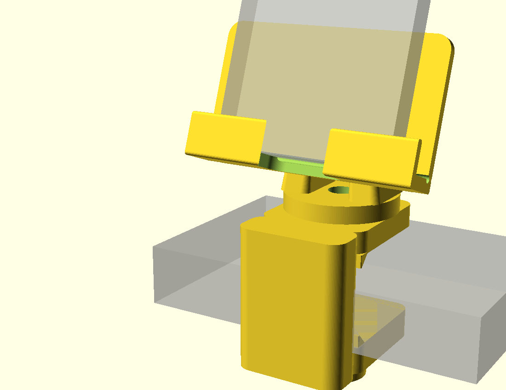
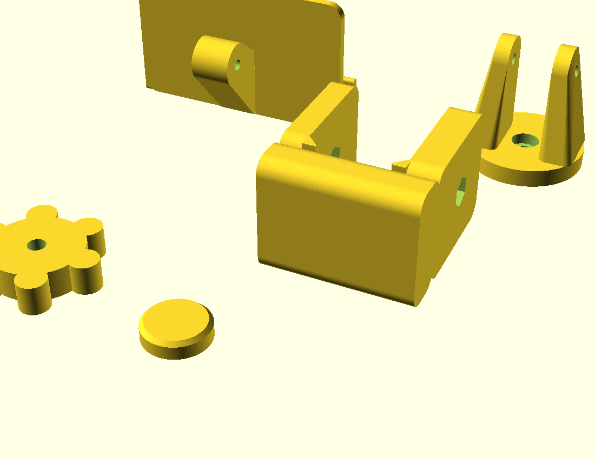
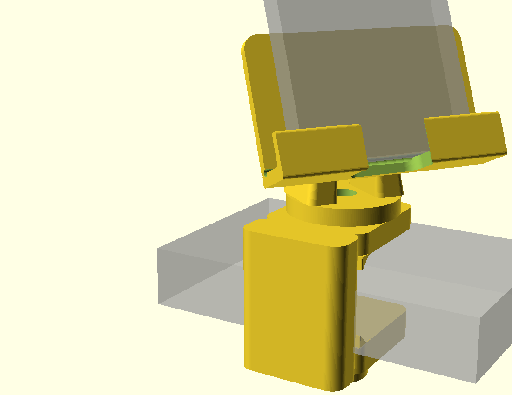

# Uchwyt na telefon na biurko

Zacisk na krawędź blatu, obrót w dwóch osiach. Model w pełni parametryczny:
[`cad/uchwyt.scad`](cad/uchwyt.scad).



## Cel

Trzymak na telefon przy stanowisku pracy: telefon ma stać na wysokości oczu obok
monitora, dać się obrócić do rozmówcy i odchylić pod kąt patrzenia. Mocowany
**zaciskiem na krawędź blatu**, dokręcanym śrubą od dołu — bez wiercenia w biurku
i z możliwością przeniesienia.

Telefon docelowy: **Samsung Galaxy S22** (146,0 × 70,6 × 7,6 mm).
Kołyska jest symetryczna — telefon można położyć **pionowo albo poziomo**.

## Materiał

**PETG** (czarny, z rolki do części funkcjonalnych).

Dlaczego nie PLA: uchwyt to nie element wystawowy. Przegub jest dociskany śrubą
przez cały czas użytkowania, a PLA pod stałym naprężeniem **pełza** (creep) —
po kilku tygodniach tarcie w przegubie spada i telefon zaczyna opadać. PETG
pełza wyraźnie wolniej i lepiej znosi cykliczne dokręcanie.

Dlaczego nie ASA: ASA jest po to, żeby wytrzymać temperaturę w samochodzie.
Na biurku nie ma 60 °C, więc płacenie za to warpingiem na otwartej A1 nie ma sensu.

## Śruby i nakrętki (do kupienia osobno)

| szt. | element | rola |
|---|---|---|
| 1 | śruba M6 × 60, łeb sześciokątny | docisk zacisku do blatu |
| 1 | nakrętka M6 | wtopiona w dolne ramię zacisku |
| 1 | śruba M6 × 30, imbus | oś obrotu pionowego + regulacja tarcia |
| 1 | nakrętka M6 | wpuszczona w górne ramię zacisku |
| 1 | śruba M4 × 40 | oś pochylenia |
| 1 | nakrętka M4 **samohamowna (nylock)** | wpuszczona w zaczep kołyski |

Nakrętka przy osi pochylenia musi być samohamowna — zwykła sama się odkręci od
ciągłego przestawiania kąta.

Przydatne, choć opcjonalne: podkładka filcowa lub kawałek gumy naklejony na
stopkę i pod górne ramię — chroni blat przed odciskiem.

## Części do wydruku

| część | gabaryty [mm] | orientacja na stole | podpory |
|---|---|---|---|
| `zacisk` | 57 × 62 × 44 | **położony na boku** (płaszczyzna litery C równolegle do warstw) | nie |
| `widelec` | 46 × 46 × 50 | tarczą do stołu | nie |
| `kolyska` | 92 × 42 × 56 | półką do stołu (tak jak stoi w użyciu) | nie |
| `stopka` | 24 × 24 × 6,5 | dowolnie, płasko | nie |
| `pokretlo` | 49 × 44 × 11 | płasko | nie |

Każda część eksportuje się osobno:

```bash
cd cad
openscad -D 'czesc="zacisk"' --export-format binstl -o ../stl/zacisk.stl uchwyt.scad
```

Gotowe pliki leżą w [`stl/`](stl/). Podgląd całego zestawu na stole: `czesc="plyta"`.



Wszystko mieści się na jednej płycie (najdalszy punkt 108 mm od środka przy polu
128 mm), ale zacisk i widelec chcą 4–5 perymetrów, więc sensowniej wrzucić je
w osobne zadanie niż podnosić perymetry całej płyty.

### Dlaczego zacisk drukuje się na boku

Przy dokręcaniu śruby ramiona zacisku są rozpychane, a grzbiet litery C pracuje
na zginanie. Gdyby zacisk stał „jak w użyciu”, te naprężenia rozrywałyby warstwy
w osi Z — czyli w najsłabszym kierunku wydruku. Położony na boku ma warstwy
równoległe do płaszczyzny litery C i zginanie działa **w** warstwie, nie w poprzek.

Kosztem tego dwa otwory M6 drukują się poziomo i wyjdą lekko owalne u góry —
rozwierć je wiertłem 6,5 mm przed montażem.

## Ustawienia druku

> Wartości startowe, nie zmierzone jeszcze na moim egzemplarzu A1 — traktować
> jako punkt wyjścia, nie jako pewnik.

| | |
|---|---|
| Warstwa | 0,2 mm |
| Ścianki | 3 (kołyska, stopka, pokrętło), **4–5 (zacisk, widelec)** |
| Wypełnienie | 25 % (kołyska) / **40 % gyroid (zacisk, widelec)** |
| Dysza / stół | ~240 °C / ~70 °C (textured PEI) |
| Brim | niepotrzebny, wszystkie części mają dużą stopę |
| Zużycie | ~154 cm³ bryły → realnie **ok. 110–140 g PETG** |

Zacisk i widelec przenoszą całe obciążenie — na nich nie ma sensu oszczędzać
na perymetrach.

## Montaż

1. Wtop nakrętkę M6 w gniazdo w **dolnym** ramieniu zacisku (od spodu) i drugą
   w gniazdo w **górnym** ramieniu (od strony szczeliny).
2. Wciśnij łeb śruby M6 × 60 w pokrętło, wkręć od dołu, nałóż stopkę na koniec śruby.
3. Przykręć widelec do górnego ramienia śrubą M6 × 30 (imbus od góry, między ramionami).
   Kołek na zacisku musi trafić w rowek w spodzie tarczy. Stopień dokręcenia = opór obrotu.
4. Wsuń zaczep kołyski między ramiona widelca **płytą oparcia od strony biurka**,
   tak żeby telefon patrzył na Ciebie. Skręć M4 × 40 z nakrętką nylock.
5. Nasuń zacisk na krawędź blatu i dokręć pokrętłem.



## Zakresy ruchu (zweryfikowane obliczeniowo)

- **Oś pionowa: dokładnie 180°.** Kołek na zacisku chodzi w rowku w spodzie
  tarczy; blokada wypada za ±90°, sprawdzone testem przenikania brył.
- **Oś pochylenia: 189° swobody** (od +4° do −185°, gdzie ujemne = odchylanie
  ekranu do użytkownika). Cały zakres przetestowany na kolizje z widelcem,
  zaciskiem i blatem, w kombinacji z pełnym zakresem obrotu pionowego.

Kołyska montuje się w widelcu odwrotnie niż wyglądałoby to naturalnie — płytą
oparcia od strony biurka. Przy montażu „na wprost” telefon patrzyłby w głąb blatu,
a skok ±90° nie pozwoliłby obrócić go do siebie.

## Status

**Zaprojektowane, nie wydrukowane.** Model kompiluje się bez błędów, wszystkie
części to zamknięte bryły manifold (CGAL: `Simple: yes`, jedna bryła na część),
kolizje przeliczone. Nic z tego nie zastąpi pierwszego wydruku.

Raport weryfikacji: [`weryfikacja.txt`](weryfikacja.txt).

### Do ustalenia przed drukiem

- **Grubość blatu.** Zacisk przyjmuje do 36 mm (`blat_max`). Zmierz swój blat —
  jeśli ma mniej niż ~15 mm, warto zmniejszyć `blat_max`, żeby nie drukować
  niepotrzebnie wysokiego zacisku i nie tracić skoku śruby.
- **Etui.** Zakładam naddatek 3,5 mm na grubość (`etui_grub`). Zmierz telefon
  w etui suwmiarką — to jedyny wymiar, który decyduje o tym, czy telefon wejdzie.
- **Tolerancje.** `luz_ruchomy = 0,35 mm` pochodzi z `CLAUDE.md`, czyli z literatury,
  a nie z pomiaru na tej drukarce. Dotyczy pasowania zaczepu w widelcu i kołka
  w rowku — jeśli test tolerancji w `kalibracja/` da inną wartość, zmień tę
  jedną zmienną i przelicz model.

## Wnioski

*(do uzupełnienia po pierwszym wydruku)*

Rzeczy do sprawdzenia na wydruku:

- Czy tarcie w obu przegubach wystarcza, żeby telefon nie opadał — i czy da się
  je ustawić tak, żeby obrót nadal był wygodny jedną ręką.
- Czy pokrętło M6 pozwala dokręcić zacisk wystarczająco mocno palcami.
- Czy warga 12 mm utrzymuje telefon przy dużym odchyleniu, czy trzeba ją podwyższyć.
- Czy wycięcie na kabel trafia w port — przy telefonie **poziomo** port wypada
  z boku, więc kabel wtedy nie przechodzi przez wycięcie. Jeśli to przeszkadza,
  do rozważenia drugie wycięcie albo szersza wnęka.
- Czy grzbiet zacisku (18 mm) wytrzymuje mocne dokręcenie. Wymiar wynika
  z rachunku: przy momencie ~2 Nm na pokrętle naprężenia zginające w grzbiecie
  to ~22 MPa, przy 14 mm byłoby ~36 MPa — czyli w okolicy wytrzymałości
  połączenia międzywarstwowego PETG.
